# BioHalo Startup Landing Page

## Aesthetic Direction

**Concept: "Bioluminescent Deep"** -- Dark, atmospheric, ocean-inspired. The intersection of biology and technology, visualized through deep marine blacks, bioluminescent teal/cyan accents, and subtle organic textures. Clean, editorial feel with scientific credibility.

- **Theme:** Dark-first (`.dark` class on `<html>`)
- **Primary palette:** Deep navy/black backgrounds (`oklch(0.13 0.02 250)`), bioluminescent teal accent (`oklch(0.75 0.15 185)`), warm highlight for CTAs
- **Typography:** A distinctive serif display font (e.g. **DM Serif Display** or **Fraunces**) for hero/section headings paired with **Geist** (already installed) for body. Tight tracking on headings (`tracking-[-2px]`).
- **Texture/atmosphere:** Subtle noise overlay, radial gradient glows behind key sections (mimicking bioluminescence), grain texture on hero
- **Motion:** Staggered entrance reveals on scroll, hover micro-interactions on cards

## Architecture

```mermaid
graph TD
    IndexPage["index.astro"] --> MainLayout["main.astro layout"]
    MainLayout --> GlobalCSS["globals.css (theme)"]
    IndexPage --> NavBar["NavBar.astro"]
    IndexPage --> HeroSection["HeroSection.astro"]
    IndexPage --> ProblemSection["ProblemSection.astro"]
    IndexPage --> SolutionSection["SolutionSection.astro"]
    IndexPage --> TechnologySection["TechnologySection.astro"]
    IndexPage --> ProductSection["ProductSection.astro"]
    IndexPage --> MarketSection["MarketSection.astro"]
    IndexPage --> RoadmapSection["RoadmapSection.astro"]
    IndexPage --> TeamSection["TeamSection.astro"]
    IndexPage --> FundingSection["FundingSection.astro"]
    IndexPage --> CTASection["CTASection.astro"]
    IndexPage --> FooterSection["Footer.astro"]
    NavBar --> ShadcnButton["Button (shadcn)"]
    SolutionSection --> ShadcnCard["Card (shadcn)"]
    SolutionSection --> ShadcnBadge["Badge (shadcn)"]
    TeamSection --> ShadcnAvatar["Avatar (shadcn)"]
    RoadmapSection --> ShadcnSeparator["Separator (shadcn)"]
```

Sections are Astro components (server-rendered). Only interactive elements (mobile nav toggle, animated counters, scroll triggers) use React islands with `client:visible` or `client:load`.

## Layout Patterns (from anima-marketing)

- **Container:** `max-w-screen-lg md:max-w-screen-xl mx-auto px-6`
- **Section vertical spacing:** `mt-24 md:mt-[100px]` between sections, `py-16 md:py-24` internal padding
- **Section header spacing:** `mb-8 md:mb-16` below section titles
- **Grid gaps:** `gap-8` for card grids
- **Primary breakpoint:** `md` for layout shifts (single-col mobile, multi-col desktop)

## Sections (from Manus scaffold + pitch deck content)

### 1. NavBar (sticky)

- Logo + nav links (Problem, Solution, Technology, Roadmap, Team)
- CTA button "Get in Touch"
- Mobile hamburger menu (React island)
- Use shadcn `Button` for CTA

### 2. Hero

- Full-viewport dark section with radial gradient glow (teal/cyan)
- Large serif heading: "Biofluorination for a Cleaner Ocean"
- Subtitle from pitch deck: "Non-biocidal antifouling agents that deliver high performance without harming marine ecosystems"
- Two CTA buttons (shadcn `Button` -- default + outline variants)
- Noise texture overlay, subtle parallax or float animation

### 3. Problem Section (`#problem`)

- Title: "The Global Impact of Biofouling"
- Three stat cards using shadcn `Card`: "$31B annual cost", "Up to 40% more fuel", "90% rely on toxic biocides"
- Brief description of fouling process
- Use `Badge` for stat labels

### 4. Solution Section (`#solution`)

- Title: "A Biological Alternative"
- Six feature cards in a responsive grid (3-col at md)
- Cards: Non-biocidal, Biodegradable, Low Fluorine, Durable, Compatible with standard binders, Regulation-aligned
- Use shadcn `Card` with `CardHeader`/`CardTitle`/`CardDescription`/`CardContent`
- Icons from `lucide-react`

### 5. Technology Section (`#technology`)

- Title: "Microbial Biofluorination"
- Visual process flow: Feedstock -> Microbes -> Biofluorination -> Products
- Advantages listed with icons (low energy, renewable feedstocks, >50% GHG reduction, biodegradable)
- Use `Separator` between steps, `Badge` for labels

### 6. Product Section

- Title: "2-FMA: Our Flagship Product"
- Product features and market applications
- Side-by-side comparison: Traditional Fluorochemicals vs BioHalo Technology
- Use shadcn `Card` for comparison layout

### 7. Market Section

- Title: "A $10B Underwater Coatings Market"
- Market stats: $222B -> $314B (5.1% CAGR)
- Target: 5% of antifouling raw materials (~$50-55M)
- Visual market opportunity display using cards or metric blocks

### 8. Roadmap Section (`#roadmap`)

- Title: "Development Roadmap"
- Vertical timeline: 2026 -> 2029+
- Milestones from pitch deck (strain optimization, pilot agreements, REACH, Series A, market launch, break-even)
- Use `Separator` for timeline line, `Badge` for year labels

### 9. Team Section (`#team`)

- Title: "Leadership Team"
- Grid of team member cards (6 members)
- shadcn `Card` + `Avatar` with `AvatarFallback`
- Name, role, brief credentials

### 10. Funding & Partners Section

- Title: "Funding & Support"
- Funding table or cards showing investors/grants
- Total raised highlight
- Use `Badge` for funding types

### 11. CTA Section

- Full-width section with gradient background
- "Join us in building the next generation of sustainable coatings"
- Two buttons: "Get in Touch" / "Learn More"

### 12. Footer

- Logo, navigation columns (Product, Company, Resources, Legal)
- Copyright
- Use `Separator` above footer

## shadcn Components to Install

Components needed beyond the existing `Button`:

- `card` -- feature cards, team cards, stat cards
- `badge` -- labels, tags, status indicators
- `avatar` -- team section
- `separator` -- visual dividers, timeline
- `navigation-menu` -- desktop nav
- `sheet` -- mobile nav drawer

Install via: `pnpm dlx shadcn@latest add card badge avatar separator navigation-menu sheet`

## Key Files to Create/Modify

| File                                                                       | Action                                                                      |
| -------------------------------------------------------------------------- | --------------------------------------------------------------------------- |
| `[packages/ui/src/styles/globals.css](packages/ui/src/styles/globals.css)` | Add custom BioHalo theme colors (teal accent, dark overrides), custom fonts |
| `[apps/web/src/layouts/main.astro](apps/web/src/layouts/main.astro)`       | Update with dark class, meta tags, font imports, slot for content           |
| `[apps/web/src/pages/index.astro](apps/web/src/pages/index.astro)`         | Replace placeholder with full landing page using MainLayout + sections      |
| `apps/web/src/components/NavBar.astro`                                     | New -- sticky navigation                                                    |
| `apps/web/src/components/MobileNav.tsx`                                    | New -- React island for mobile menu (Sheet)                                 |
| `apps/web/src/components/HeroSection.astro`                                | New -- hero with gradient + CTAs                                            |
| `apps/web/src/components/ProblemSection.astro`                             | New -- stats + description                                                  |
| `apps/web/src/components/SolutionSection.astro`                            | New -- feature cards grid                                                   |
| `apps/web/src/components/TechnologySection.astro`                          | New -- process flow                                                         |
| `apps/web/src/components/ProductSection.astro`                             | New -- 2-FMA details + comparison                                           |
| `apps/web/src/components/MarketSection.astro`                              | New -- market opportunity                                                   |
| `apps/web/src/components/RoadmapSection.astro`                             | New -- timeline                                                             |
| `apps/web/src/components/TeamSection.astro`                                | New -- team grid                                                            |
| `apps/web/src/components/FundingSection.astro`                             | New -- funding/partners                                                     |
| `apps/web/src/components/CTASection.astro`                                 | New -- call to action                                                       |
| `apps/web/src/components/Footer.astro`                                     | New -- site footer                                                          |

## Implementation Order

The build follows a top-down approach: theme and infrastructure first, then sections from top to bottom of the page.